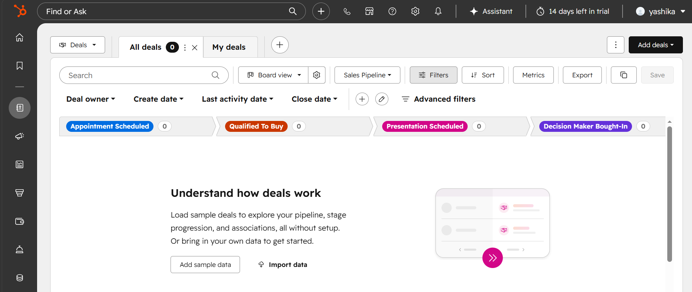
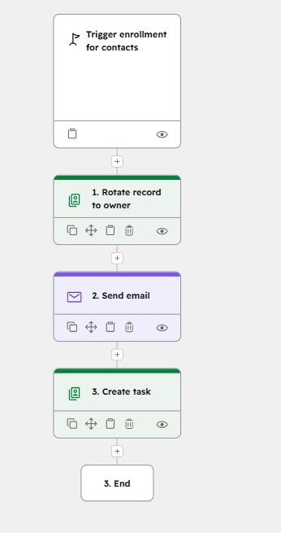

# CRM Sales Automation Demo — HubSpot Sandbox

## Overview
Built a CRM sales automation workflow in HubSpot sandbox simulating a lead-to-conversion sales process for a fictional D2C skincare brand.

## Features
- Lead management pipeline
- Automated owner assignment
- Follow-up email automation
- Task reminders for sales reps
- Sales pipeline stages
- CRM workflow automation

## Workflow
New Contact Created
→ Assign Contact Owner
→ Send Welcome Email
→ Create Follow-Up Task

## Tools Used
- HubSpot CRM
- HubSpot Workflows
- Sales Pipeline Automation

## Screenshots
### Pipeline

### Workflow

## Business Value
This project demonstrates CRM automation, lead lifecycle management, sales operations workflows, and customer engagement automation.
